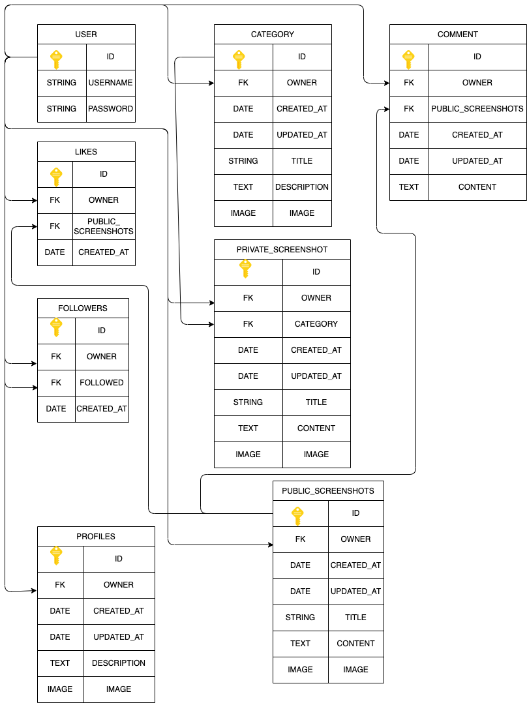
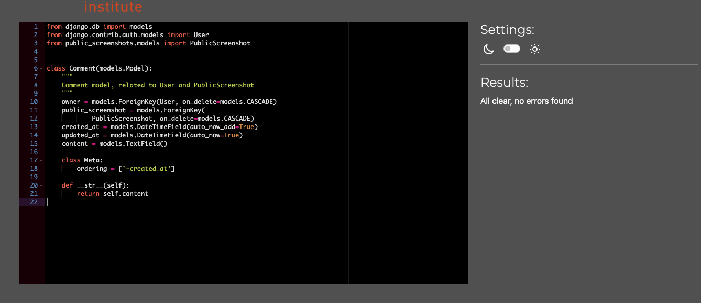
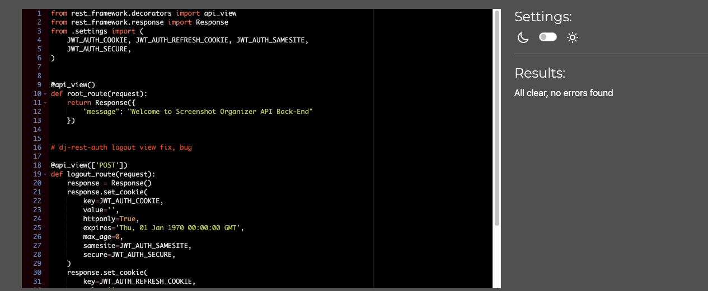
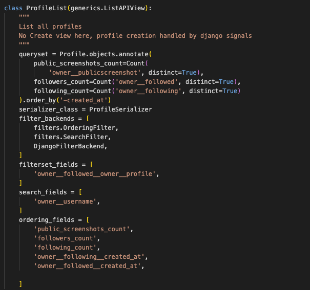
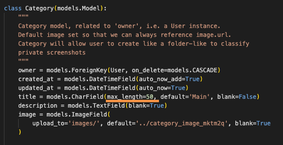
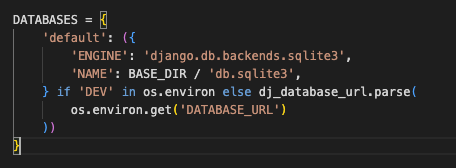
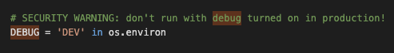
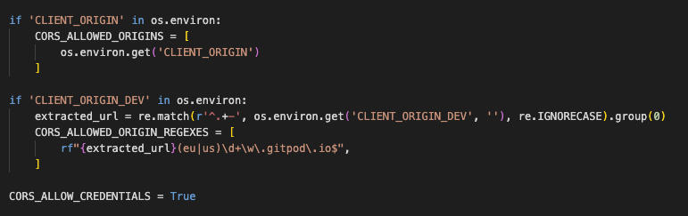
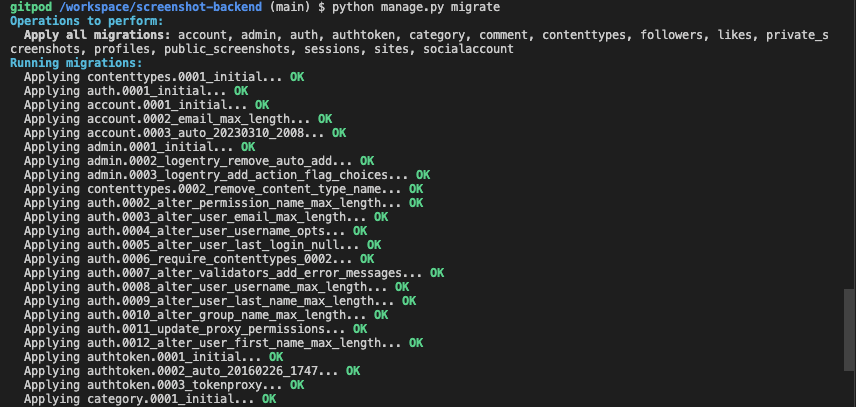

# Note

To enhance your reading experience of this documentation, we recommend not using the dark mode of Github, as it may display images with distorted colors that do not accurately reflect reality.

# Purpose of this project

In today's digital world, we often struggle to locate important resources when we need them the most. Thankfully, we have a helpful tool called a screenshot, which enables us to capture and preserve a screen image of vital information or instant snapshots of a situation. If you have ever searched for an old email with critical address details, you can relate to the challenge of finding specific screenshots of this event from a massive collection of files with generic names on Desktop location. Sometimes, we may need to capture evidence of a non-working service or keep a record of changes made to a system. However, locating the right screenshot from hundreds of files can be time-consuming and frustrating. 


There have been many instances where I have needed an application that allows me to search for a specific screenshot using keywords. That is precisely what the Screenshot Organizer app does, and it is the focus of this document that I will be presenting.

Personal Note :

When editing a README file for a project, I always have a section called "Fixed bugs" where I'm supposed to list any bugs I encountered during the development of the app and explain how I solved them. However, it can be frustrating to recall a specific bug I had without the accompanying screenshots. That's an other reason I decided to developp this app, specifically for capturing these bugs and organize them. This way, I can easily find them later and save time searching through my desktop.


Analys of the main problem:

- Difficulty locating specific screenshots: With the abundance of digital features available, finding a particular screenshot from a vast collection of files with generic names can be challenging and time-consuming.

- Inefficient management of digital assets: The process of scrolling through hundreds of files to locate the right screenshot is not only frustrating but also inefficient. A dedicated app like Screenshot Organizer can help users better manage their digital assets and streamline their workflow.


This project was developed in order to demonstrate 
some ability to :
- code in Python
- deal with boostrap React
- manipulate REST Framework
- understand API
- build an App with Back-End and Front-end developpement
- code with ReactJS

[Back-End : Check this out!](https://screenshot-organizer-backend.herokuapp.com/)

[Front-End : Check this out!](https://screenshot-organizer-frontend.herokuapp.com/home)

# Screenshot Organizer

Screenshots are a fascinating phenomenon in the digital age. They capture a stolen moment in time that only you can see on your computer screen, making it a unique piece of digital art. The ability to share this image with the rest of the world is a powerful concept that has the potential to inspire, provoke thought, or even make someone smile.

In a world where we are constantly bombarded with information, a screenshot can capture a specific moment that resonates with us in a personal way. It can evoke a range of emotions and stir up memories that we may have forgotten. It's a visual snapshot of our digital lives that we can choose to keep private or share with others.

The act of taking a screenshot is a form of creative expression, capturing an instant in time that can never be replicated. It's a reflection of who we are and the world we inhabit, offering a glimpse into our digital experiences.

So, whether it's a funny meme, a touching message from a loved one, or an inspirational quote, a screenshot has the power to bring people together and create a shared experience. It's a testament to the power of technology and a such of unique ways in which it allows us to connect and express ourselves.

# Contents

* [Database Schema](<#database-schema>)
* [Some Thinkings](<#some-thinkings>)
* [Technologies Used](<#technologies-used>)
     * [Languages](<#languages>)
     * [Libraries](<#libraries>)
     * [Platforms](<#platforms>)
     * [Resources](<#resources>)
* [Testing](#testing)
     * [APITestCase](#Aapitestcase)
     * [Manual Testing](#manual-testing)
     * [CRUD Testing](#crud-testing)
     * [Validator Testing](#validator-testing)
* [Features](#features)
* [Future Features](#future-features)
* [Bugs](<#bugs>)
    * [Fixed](<#fixed>)
    * [Unfixed](<#unfixed>)

* [Deployment](<#deployment>)
    * [Set up and configuration](<#set-up-and-configuration>)
* [Credits and media](<#credits-and-media>)
* [Media](<#media>)


# Database Schema

The database for this project is composed by :

- User : To store a new user's username and password.
- Profiles : to register User's Profile (avatar, description etc..)
- Screenshot_public : to store a post with a screenshot, content, title , image.
- Screenshot_private : to store a post with a private screenshot with content, image, title, category (see below)
- Category : to store all the differents categories of private screenshots (emails, jobs, entertainement, flights, meetings, social media, foods, bills, conversations chat etc...)
- Comment : to store all the comment connected to a public screenshot
- followers : to store all the followers and followings id of user so we known who is following who
- likes : to store all the likes register to public screenshots

To accomplish this, I had to develop a database table model to streamline the application's functionality. I used [Visual Studio Code](https://code.visualstudio.com/) to generate the following : (If the content seems black, turn off NIGHT mode on github please :-D)



[Back to top](<#contents>)

# Some thinkings

Prior to starting the app development process, I conducted a thorough evaluation to determine the app's purpose. As I recognized that the back end of the app needed to be well-designed for optimal front-end coding, I spent considerable time contemplating the user experience (UX) and placement of the search bar. The REST framework's permissions feature afforded me the opportunity to plan data accessibility and determine what type of data would be accessible to whom and how.

I began by establishing a UX that was conducive to the design of the app, ensuring that users could add as many categories as they wished without page-loading delays. To accomplish this, pagination was necessary. My main objective was to create a tool that enabled users to locate the desired information rapidly. Thus, I implemented a search bar, which allows users to search screenshots inside a  selected category items, search a screenshot in general or by users.

To create a clear delineation between the public and private aspects of the app, I split the app into two distinct spaces: Private and Public. Private space is reserved for personal screenshots and is accessible only to the owner. Users cannot comment, like, or share these screenshots. Public space allows users to publish their screenshots, and any user, whether logged in or not, can view them. However, users must log in to comment, like, and follow the owner of a screenshot.

To help users locate categories quickly, I devised a unique method of categorization using images or avatars. Users can choose an avatar that best represents their category. 


I placed a character limit on the category name to maintain good CSS display.

Finally, I applied specific criteria to uploaded images, including size, height, and width, to avoid overloading the app or displaying poorly due to large images.


[Back to top](<#contents>)
# Technologies Used

### Languages

- [Python](https://www.python.org/) - Main language for the Back-end part of this project.
- [Django](https://pypi.org/project/Django/3.2.14/) - Web framework used to develop the project.
- [djangorestframework](https://pypi.org/project/djangorestframework/3.14.0/) - Toolkit for building web API's with Django.


### Libraries

The following libraries were used to build the project:

  - [dj-database-url](https://pypi.org/project/dj-database-url/0.5.0/) - Database connectivity
  - [django-allauth](https://pypi.org/project/django-allauth/0.51.0/) - Authentification features
  - [cloudinary](https://pypi.org/project/cloudinary/1.30.0/) - Images Cloud service
  - [django-cloudinary-storage](https://pypi.org/project/django-cloudinary-storage/0.3.0/) - Cloudinary intergration.
  - [djangorestframework-simplejwt](https://pypi.org/project/djangorestframework-simplejwt/5.2.1/) - JSON Web Token authentication backend for the Django REST Framework.
  - [dj-rest-auth](https://pypi.org/project/dj-rest-auth/2.2.5/) - API endpoints for authentifications within Django Rest Framework.
  - [django-filter](https://pypi.org/project/django-filter/22.1/) - QuerySet filtering Tools.
  - [Pillow](https://pypi.org/project/Pillow/9.2.0/) - the Python Imaging Library.
  - [psycopg2](https://pypi.org/project/psycopg2/2.9.3/) - Python PostgreSQL database adapter.
  - [django-cors-headers](https://pypi.org/project/django-cors-headers/3.13.0/) - Django App.
  - [gunicorn](https://pypi.org/project/gunicorn/20.1.0/) - HTTP Server to deploy the back end of this project.
  - [Pillow](https://pypi.org/project/Pillow/9.2.0/) - the Python Imaging Library.
  - [psycopg2](https://pypi.org/project/psycopg2/2.9.3/) - Python PostgreSQL database adapter.

[Back to top](<#contents>)


### Platforms

- [Gitpod:](https://gitpod.io/)
  - Code Editor used for this project
- [GitHub:](https://github.com/)
  - Code hosting and management of User-stories by segmenting the development process into milestones.
- [Heroku:](https://id.heroku.com/login)
  - Deployment of the project LIVE
- [Cloudinary:](https://console.cloudinary.com/)
  - Cloud Storage of images
- [ElephantSQL:](https://customer.elephantsql.com/login)
  -  Hosting database

[Back to top](<#contents>)


### Resources

I used the fantastic documentation from [Django Rest Framework:](https://www.django-rest-framework.org/).


[Back to top](<#contents>)


# Testing

### APITestCase

I ve been executing some basic automatic Testing on the back end.

Creating 2 users :

```
def setUp(self):
        me = User.objects.create_user(username='me', password='me@password')
        category_default1 = Category.objects.create(
            owner=me,
            title='Main',
            
        )
        not_me = User.objects.create_user(username='not_me', password='not_me@password')
        category_default2 = Category.objects.create(
            owner=not_me,
            title='Main',
            
        )
```

Creating a PrivateScreenshot for both users :

```
PrivateScreenshot.objects.create(
            owner=me, 
            title='my first screenshot private', 
            content='This is my very first screenshot', 
            id=1,
            category=category_default1,
        )
        
        PrivateScreenshot.objects.create(
            owner=not_me, 
            title='my first screenshot private', 
            content='This is my very first screenshot', 
            id=2,
            category=category_default2,
        )
```

Testing if category is created when user is created :

```
    def test_exists_category_when_creating_user(self):
        """
        Testing if a category instance is created when created a User instance
        """
        self.client.login(username='me', password='me@password')
        response = self.client.get('/category/1/')
        self.assertEqual(response.data['title'], 'Main')
        self.assertEqual(response.status_code, status.HTTP_200_OK)

```

[Back to top](<#contents>)

Testing if unlogged users can read other category 's users :

```
    def test_read_category_when_not_logged_user(self):
        """
        Testing to read a category from an other user
        """
        response = self.client.get('/category/1/')
        self.assertEqual(response.status_code, status.HTTP_403_FORBIDDEN)
```

Testing if logged users can read a private screenshot from an other user:

```
    def test_read_private_screenshot_not_own_by_user(self):
        """
        Testing to read a private screenshot from an other user
        """
        self.client.login(username='me', password='me@password')
        response = self.client.get('/private-scrshot/2/')
        self.assertEqual(response.status_code, status.HTTP_404_NOT_FOUND)
```

Testing if a logged user can read a owned private screenshot :

```
    def test_read_private_screenshot_own_by_user(self):
        """
        Testing to read a private own screenshot 
        """
        self.client.login(username='not_me', password='not_me@password')
        response = self.client.get('/private-scrshot/2/')
        self.assertEqual(response.status_code, status.HTTP_200_OK)
```

Creating 2 users and a public screenshot for each:

```
def setUp(self):
        me = User.objects.create_user(username='me', password='me@password')
        not_me = User.objects.create_user(username='not_me', password='not_me@password')
        PublicScreenshot.objects.create(
            owner=me, title='my first screenshot', content='This is my very first screenshot', id=1
        )
        PublicScreenshot.objects.create(
            owner=not_me, title='my first screenshot', content='This is my very first screenshot', id=2
        )
```

[Back to top](<#contents>)

Different testing about CRUD (Creation, Reading, Update and deleting) :

```
def test_read_screenshot(self):
        """
        Testing a user reading a screenshot
        """
        response = self.client.get('/public-scrshot/1/')
        self.assertEqual(response.data['title'], 'my first screenshot')
        self.assertEqual(response.status_code, status.HTTP_200_OK)


    def test_read_screenshot_with_invalid_id(self):
        """
        Testing a user reading a screenshot using an invalid ID
        """
        response = self.client.get('/public-scrshot/99999999/', format='json')
        self.assertEqual(response.status_code, status.HTTP_404_NOT_FOUND)


    def test_delete_own_screenshot(self):
        """
        Testing a user deleting a own screenshot 
        """
        self.client.login(username='me', password='me@password')
        response = self.client.delete('/public-scrshot/1/', format='json')
        response = self.client.get('/public-scrshot/1/', format='json')
        self.assertEqual(response.status_code, status.HTTP_404_NOT_FOUND)


    def test_update_own_screenshot(self):
        """
        Testing a user updating a own screenshot 
        """
        self.client.login(username='me', password='me@password')
        response = self.client.put('/public-scrshot/1/', {
          'owner': 'me', 'title': 'new title'
        }, format='json')
        publicscreenshot =  PublicScreenshot.objects.filter(pk=1).first()
        self.assertEqual(publicscreenshot.title, 'new title')
        self.assertEqual(response.status_code, status.HTTP_200_OK)


    def test_update_not_own_screenshot(self):
        """
        Testing a user updating a screenshot from other user
        """
        self.client.login(username='me', password='me@password')
        response = self.client.put('/public-scrshot/2/', {
            'title': 'a new title'}, format='json')
        self.assertEqual(response.status_code, status.HTTP_403_FORBIDDEN)
```

All Tests passed successfully.


[Back to top](<#contents>)


### Manual Testing

EndPoints Testing :

| Action | Result | Checked? |
|:-------:|:--------|:--------|
| URL : /category/ | Reacheable | &check; |
| URL : /category/<int:pk>/ | Reacheable | &check; |
| URL : /comments/ | Reacheable | &check; |
| URL : /comments/<int:pk>/ | Reacheable | &check; |
| URL : /followers/ | Reacheable | &check; |
| URL : /followers/<int:pk>/ | Reacheable | &check; |
| URL : /likes/ | Reacheable | &check; |
| URL : /likes/<int:pk>/ | Reacheable | &check; |
| URL : /private-scrshot/ | Reacheable | &check; |
| URL : /private-scrshot/<int:pk>/ | Reacheable | &check; |
| URL : /profiles/ | Reacheable | &check; |
| URL : /profiles/<int:pk>/| Reacheable | &check; |
| URL : /public-scrshot/ | Reacheable | &check; |
| URL : /public-scrshot/<int:pk>/| Reacheable | &check; |


[Back to top](<#contents>)

### CRUD Testing


- App category

| Action | Not Logged | owner(logged) | Not owner(logged) | Checked? |
|:-------:|:--------|:--------|:--------|:--------|
| READ | 404 error | &check; | 404 error | &check; |
| CREATE | 404 error | &check; | 404 error | &check; |
| DELETE | 404 error | &check; | 404 error | &check; |
| UPDATE | 404 error | &check; | 404 error | &check; |


- App comment

| Action | Not Logged | owner(logged) | Not owner(logged) | Checked? |
|:-------:|:--------|:--------|:--------|:--------|
| READ | &check; | &check; | &check; | &check; |
| CREATE | 404 error | &check; | 404 error | &check; |
| DELETE | 404 error | &check; | 404 error | &check; |
| UPDATE | 404 error | &check; | 404 error | &check; |

- App followers

| Action | Not Logged | owner(logged) | Not owner(logged) | Checked? |
|:-------:|:--------|:--------|:--------|:--------|
| READ | &check; | &check; | &check; | &check; |
| CREATE | 404 error | &check; | 404 error | &check; |
| DELETE | 404 error | &check; | 404 error | &check; |
| UPDATE | 404 error | &check; | 404 error | &check; |

- App likes

| Action | Not Logged | owner(logged) | Not owner(logged) | Checked? |
|:-------:|:--------|:--------|:--------|:--------|
| READ | &check; | &check; | &check; | &check; |
| CREATE | 404 error | &check; | 404 error | &check; |
| DELETE | 404 error | &check; | 404 error | &check; |
| UPDATE | 404 error | &check; | 404 error | &check; |

- App private_screenshots

| Action | Not Logged | owner(logged) | Not owner(logged) | Checked? |
|:-------:|:--------|:--------|:--------|:--------|
| READ | 404 error | &check; | 404 error | &check; |
| CREATE | 404 error | &check; | 404 error | &check; |
| DELETE | 404 error | &check; | 404 error | &check; |
| UPDATE | 404 error | &check; | 404 error | &check; |


- App profiles

| Action | Not Logged | owner(logged) | Not owner(logged) | Checked? |
|:-------:|:--------|:--------|:--------|:--------|
| READ | 404 error | &check; | &check; | &check; |
| CREATE | 404 error | 404 error | 404 error | &check; |
| DELETE | 404 error | 404 error | 404 error | &check; |
| UPDATE | 404 error | &check; | 404 error | &check; |


- App public_screenshots

| Action | Not Logged | owner(logged) | Not owner(logged) | Checked? |
|:-------:|:--------|:--------|:--------|:--------|
| READ | &check; | &check; | &check; | &check; |
| CREATE | 404 error | &check; | 404 error | &check; |
| DELETE | 404 error | &check; | 404 error | &check; |
| UPDATE | 404 error | &check; | 404 error | &check; |


[Back to top](<#contents>)

### Validator Testing

I used [Pep8 Validator](https://pep8ci.herokuapp.com/) to check my python code into all python file of the project, all results below are with no errors :





[Back to top](<#contents>)


[Back to top](<#contents>)


[Back to top](<#contents>)


[Back to top](<#contents>)


[Back to top](<#contents>)




[Back to top](<#contents>)


# Features

All categories will be displayed order by "number of private screenshot" :


[Back to top](<#contents>)

When a User is created, automatically a first category is registered into database.
When user want to add a private screenshot to the App, User will have to select in what category
it will be published. 


This Fields cannot be empty, otherwise a new screenshot cannot be added to the database. (Filed required and is a Foreign Key from Private screenshot Model).


So for that, I also check that when is about deleting a category always at least one category is left.


If user try to delete the last category, it will see the following message :


[Back to top](<#contents>)

Public/private screenshot count for profile :


Some filter for profiles Models :



Some filters for public screenshots :


[Back to top](<#contents>)


# Future Features


  - Allow more type of file to upload as pdf or txt
  - Encryption of the images so they cannot be displayed even you have the raw URL from the CLoud where are situated the files
  - Proof of Action stamp joined to public screenshot to proof authenticity. So users cannot publish a screenshot that already been published by an other user. Copyrights scan can be implemented.


[Back to top](<#contents>)

# Bugs

### Fixed

First deployment on Heroku, I got a error message :


Fixed by following the intructions :


An other bugs came up when i changed some parameters to one of the models : max_length = 25



Unfortunately, I had already some items into database with a length reaching 50 characters, so it gives this following error :


I had 2 options :
- deal with deleting previous migrations and risking to loose integrity into database
- delete manually all the items with characters > 25

I chosed the second option for more security.

[Back to top](<#contents>)

### Unfixed

No Unfixed bugs...

[Back to top](<#contents>)

# Deployment

### Set up and configuration

The project was deployed to [Heroku](https://www.heroku.com). To deploy, please follow the process below:

The site was deployed to Heroku cloud Platform. To be able to run your python program on the web, you need Heroku Cloud platform to host it and deploy. There are severals steps to proceed, please , follow carefully every steps :

1. Follow this link : [Code Institute template](https://github.com/Code-Institute-Org/gitpod-full-template) and then click 'Use this template'.


2. Then click 'Create Repository From Template'.

3. Click Green 'Gitpod' button on right side of the page.


4. Install Django and libraries. to do that, type the commands below :

<details><summary>Commands to install Django and Libraries</summary>

  * ```pip install 'django<4'```
  * ```django-admin startproject YOUR API .```
  * ```pip install django-cloudinary-storage```
  * ```pip install Pillow```
  * ```pip install djangorestframework```
  * ```pip install django-filter```
  * ```pip install dj-rest-auth==2.1.9```
  * ```pip install 'dj-rest-auth[with_social]'```
  * ```pip install djangorestframework-simplejwt```
  * ```pip3 install gunicorn django-cors-headers```
  * ```pip install dj_database_url psycopg2```
  * ```pip install dj_database_url psycopg2```
  
</details><br />  


On settings.py : 


on urls.py : 


create the file requirements with all dependencies :


Make sure you have this version of dj-rest-auth into requirements file :


First migration :


[Back to top](<#contents>)


On urls.py file :


[Back to top](<#contents>)

Settings.py file : 


Create a file env.py before first git push! important


[Back to top](<#contents>)

Take out this line from settings.py :


On settings.py : 


Create an new instance on ElephantSQL:


Create a new instance on Heroku platform:


[Back to top](<#contents>)

Create a new App:


Configuration CONFIG VARS :


On settings.py :


Env.py :


on Settings.py :




Create a Procfile :


[Back to top](<#contents>)

With this content :


Settings.py : 


Adding some new VARS to heroku :


settings.py :


Set DEBUG on 'DEV' , if DEV = 1 into env.py it will run as DEV 



[Back to top](<#contents>)

Update dependencies :


Settings.py : 




Make migration :



Connect your github account to Heroku :


[Back to top](<#contents>)

Deploy the app : It's LIVE


Create a super User :


Check that superuser is created :


If any problems during deployment, first, be sure to have the following on your requirements.txt file :


[Back to top](<#contents>)

# Credits and Media


* The Text of the App is provided by me
* The favicon came from [Favicon](https://favicon.io/)
* Some of images on the App has been created with [Bitmoji](https://www.bitmoji.com/)
* The rest of the images came from a very old harddisk I have from 2003 with images from the web in general.


## Best part of this project

To be honest, best parts of my learning progress in this project are the following :
- Learning REST framework
- Learning how to set up database on back-end with filter and permissions configuration
- Learning more about Django in general


[Back to top](<#contents>)

## Personal Development

I am extremely pleased with the experience of working on this project, as it has provided me with valuable insights into database building. My perspective has been transformed, and I now possess powerful tools that enable me to create well-configured and coded backends. With this newfound knowledge, I can develop apps much more efficiently and effectively, resulting in faster front-end development.

[Back to top](<#contents>)

## Acknowledgements
This App was completed as a Portfolio 5 Project (Back-end Part) for the Full Stack Software Developer Diploma at the [Code Institute](https://codeinstitute.net/).
As such I would like to thank the REST framework Team for writing this fantastic documentation for us, the Slack community for the good vibes and my mentor **Martina** for the support.

This material has been prepared for educational purposes only.

Damien B.

[Back to top](<#contents>)

veed for gif image
Bitmoji.com for images
